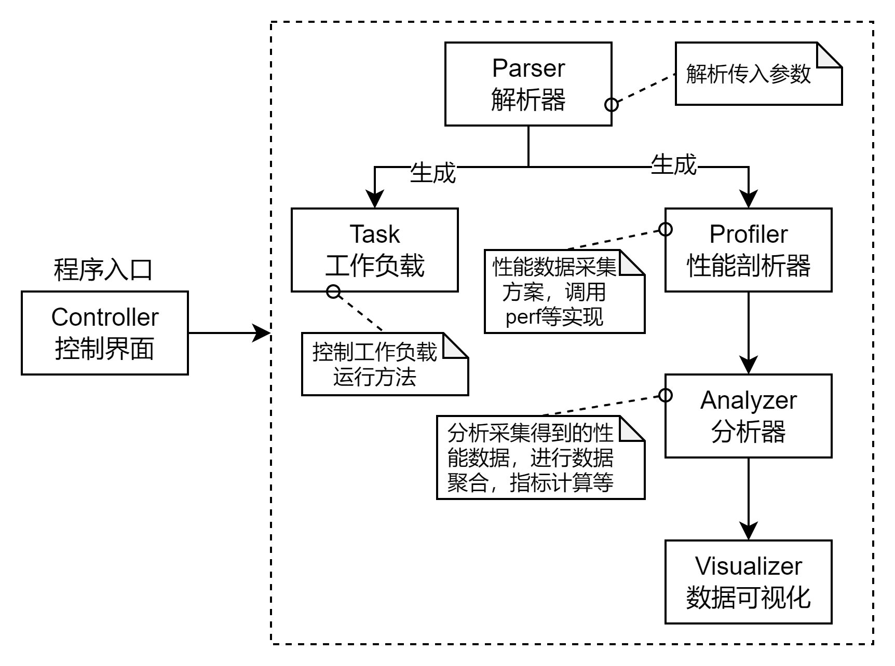

# hperf

## 概述

跨平台的微架构性能数据采集工具hperf

### 命名

hperf的名称取自Hierarchical Performance Profiling Tools，使用一种层次化的性能数据采集方法以及性能分析方法，Hierarchical具体体现在：

- 收集软硬件全栈各个层次的性能数据，从微架构层面的PMU性能数据到系统软件层面的操作系统性能数据，提供全面的工作负载性能画像
- 使用层次化的性能分析方法，逐层分解并定位到性能瓶颈

### 性能数据来源

hperf的性能数据来源包括底层PMU（核内部分与核外部分），操作系统，上层工作负载（包括benchmark与real-workload），各部分具有代表性的性能数据如下图所示：


> 目前工具还是主要关注PMU层面的微架构性能数据，OS层面的性能数据目前主要依靠perf的软件性能事件获得一些OS内核部分的统计数据。

### 特性

hperf的特性列举如下：

- 跨平台：支持主流平台，x86架构的Intel与AMD，ARM架构的Kunpeng与Ampere，并且可扩展，甚至拓展至RISC-V平台
- 准确、可靠的微架构性能数据采集：基于对主流底层PMU架构与Linux perf_event子系统调度机制的深入理解上，通过时分复用底层硬件计数器的方式，有效地采集充足的性能事件，设置性能事件组使得关联性能事件在同一时刻测量，保证导出指标的可靠性与准确性
- 跨平台的性能分析方法：通过采集得到的可靠的微架构性能数据，基于Iron Law对CPI进行逐层分解，给出微架构各个组件对性能的影响，以定位性能瓶颈
- 采用C-S架构：客户端建立与待测机器的SSH连接，控制待测机器执行性能剖析任务，客户端拉取待测机器的输出到本地进行分析，待测机器上无需额外安装软件（客户端也可部署在待测机器上），也不会产生额外的性能开销，尽量避免测量的干扰

> 目前的设想，采集性能数据之后的分析是一个可选的，并且采集与分析各自的逻辑是独立的，用户调用的时候可以只输出性能数据就结束。

## 设计

### 用户接口

hperf以命令行的方式进行调用，提供若干命令行选项指定如何性能剖析，也可以通过配置文件（可读性强的，例如JSON格式）的方式定义性能剖析任务。

hperf应当克服利用perf采集微架构性能数据具有较高门槛的问题，使得perf_event子系统的调度机制、底层硬件计数器数量等内部机制对用户透明，用户无需关心底层发生了什么，就可以进行可靠、高效、准确的微架构性能数据。

配置文件需要定义：

- 建立SSH连接的方式：待测机器的IP地址，登录用户名与密码
- 性能剖析前需要完成的工作：如何在服务器端与客户端启动工作负载，需要执行什么命令
- 性能剖析后需要完成的工作：如何在服务器端与客户端关闭工作负载，需要执行什么命令
- 性能剖析任务：
  - 收集哪些性能数据：提供用户自定义采集哪些性能数据的选项，通常无需指定，hperf会根据性能分析方法的需要搜集性能数据，根据不同平台的架构设计测量方案（包括性能事件分组）
  - 测量方式：监测进程，还是监测系统所有CPU还是某些CPU；使用采样方式（监测一段时间，针对real-application）还是完整监测（从工作负载开始运行到运行结束，针对benchmark）
- 结果输出方式：如何输出测量与分析结果

hperf提供常见benchmark与real-application性能剖析任务对应的配置文件，用户简单编辑后即可使用。

例如，hperf提供了redis的配置文件，可以在客户端用如下方式调用该命令，其中配置文件定义的待测机器SSH连接方式可以被命令行覆盖，即在主机ip地址是202.120.87.120的主机上执行redis.json配置文件定义的性能剖析任务。

```bash
$ hperf -h 202.120.87.120 -c redis.json
```

### 性能剖析流程

hperf采用了C-S架构，对于待测机器在某一工作负载下的性能剖析任务，其基本流程如下面的泳道图所示。

> 这里的“客户端”实际上就是一个“控制装置”，起到流程自动化的作用，工作负载的运行和性能剖析任务都是在远程待测机器上。


### 设计类

基于面向对象的设计方法，实现hperf的几个关键类及其关系如下图所示：



其中的几个模块的功能以及实现方案说明如下：

#### 控制界面 Controller

负责控制hperf的整体流程，控制输入与输出以及异常处理。

hperf是使用命令行调用，从命令行传入选项和参数，Controller负责将接收到的选项和参数传递给Parser，Parser将解析传入选项和参数生成Task与Profiler的实例，Controller分别调用Task和Profiler确定的工作负载运行方法与性能剖析方法，Profiler生成结果后交给Analyzer进行分析，最后根据Analyzer的分析结果Visualizer进行可视化。

#### 解析器 Parser

Controller传入从命令行接收的选项和参数交给Parser解析，根据解析的结果生成用于描述工作负载的Task实例和用于进行性能剖析的Profiler实例。

hperf支持JSON格式的配置文件，可以使用`-c <config_file>`选项传入配置文件，配置文件有若干key-value用于描述如何运行工作负载以及如何进行性能剖析。

同时还支持通过命令行选项进行配置，其中命令行选项的优先级大于配置文件，即命令行选项可以覆盖配置文件中的选项。

例如`hperf -h 202.120.87.120 -c redis.json`，例如配置文件中定义了待测机器的主机IP地址为202.120.87.80，但是由于命令行选项的优先级更高，所以读取后以命令行选项的设定为准。

Parser读取配置文件与命令行选项后，对于未设置的选项会以默认选项进行，同时会对配置进行合法性校验，对于缺少的选项抛出异常并给出提示信息。

Parser将根据读取得到的配置，生成Task实例与Profiler实例。

Parser可以使用Python内置的argparse包实现，可以很方便地设置选项和参数的逻辑，以及帮助和提示信息。

#### 工作负载 Task

用于描述工作负载，对外提供run与terminate的方法控制待测机器运行或停止指定工作负载。

工作负载主要分为benchmark与real-application，本质上都是在待测机器上使用一条或多条命令运行个程序。

工作负载在运行的时候，可能需要“绑核”以提高性能或避免跨socket/NUMA node的访问，即使用numactl命令工作负载。

如果hperf就是部署在待测机器上，直接在待测机器上执行相应的命令即可，可以使用Python内置的subprocess创建一个子进程运行工作负载。

但考虑到部分real-application是C-S架构的，或者想把测到的性能数据拉回本地分析，此时就需要如上面设计的性能剖析流程涉及到的客户端和服务器端，客户端通过配置SSH连接，例如使用paramiko第三方库建立远程终端，控制远程待测机器执行相应指令并解析输出结果。

从实现上来看Task可以作为一个基类，派生为LocalTask和RemoteTask，分别对应本地的工作负载和远程的工作负载。

#### 性能剖析器 Profiler

用于描述性能数据测量方法以及性能指标的计算，对外提供profile方法控制待测机器对指定工作负载调用相关工具进行性能数据采集。

目前而言性能剖析器主要还是调用待测机器上的perf来进行，本质上是根据待测机器对应的平台配置需要测量的性能事件，合理设置event groups（根据指标计算的可靠性以及平台性能计数器的数量），以生成`perf stat`的命令，输出性能分析

性能剖析器需要每隔一定时间（通常为1s）进行一次采样，记录当前时间间隔内，每一个单元（对于core的事件是每一个核，对于uncore的事件则为相应的对象，例如多个核共享的LLC）性能事件的测量结果并保存，perf stat record支持这样的操作并生成perf.data文件（或者从便于解析的角度输出其他文本格式）。

关于平台的性能计数器数量，计划实现一个Python脚本，与其他项目源码类似，放在项目目录的/utils目录下，可以根据之前论文提出的方法来实现。

同样的，与Task一样，Profiler可能与hperf运行在同一台机器上，也可能是客户端通过SSH连接控制远程机器执行perf，在最终调用perf时，需要提供接口设置是在本地的待测机器上执行还是远程的待测机器上执行。

#### 分析器 Analyzer

用于分析Profiler生成的原始测量数据，进行数据处理与聚合，指标计算，以及后续可选的性能分析方法定位性能瓶颈。

对于微架构性能数据的采集，大多需要使用复用的方法进行，perf输出的数据是根据采样比scaled的估计数据，如果有必要，可以考虑以不同的方法来对原始数据进行处理。

数据聚合应当提供不同的视角，例如对于core部分的性能数据，提供per core，per NUMA node，per socket，per die等，以不同的方式对性能数据进行聚合，在不同的视角下给出性能指标。上述数据聚合和指标计算，应当对每一个采样进行，可以形成一个时间序列。

从实现角度可以借助Python数据分析的库，例如numpy和pandas实现。

#### （可选）数据可视化 Visualizer

用于将分析器输出的性能数据可视化，从实现的角度可以借助matplotlib来实现。