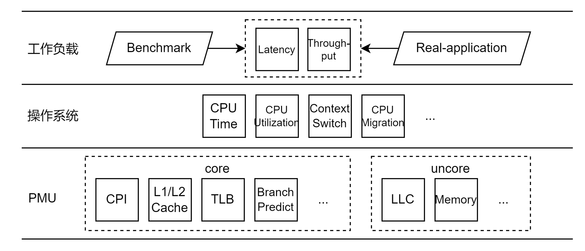

# hperf

## 概述

跨平台的微架构性能数据采集工具hperf

### 命名

hperf的名称取自Hierarchical Performance Profiling Tools，使用一种层次化的性能数据采集方法以及性能分析方法，Hierarchical具体体现在：

- 收集软硬件全栈各个层次的性能数据，从微架构层面的PMU性能数据到系统软件层面的操作系统性能数据，提供全面的工作负载性能画像
- 使用层次化的性能分析方法，逐层分解并定位到性能瓶颈

### 性能数据来源

hperf的性能数据来源包括底层PMU（核内部分与核外部分），操作系统，上层工作负载（包括benchmark与real-workload），各部分具有代表性的性能数据如下图所示：



> 目前工具还是主要关注PMU层面的微架构性能数据，OS层面的性能数据目前主要依靠perf的软件性能事件获得一些OS内核部分的统计数据。

### 特性

hperf的特性列举如下：

- 跨平台：支持主流平台，x86架构的Intel与AMD，ARM架构的Kunpeng与Ampere，并且可扩展，甚至拓展至RISC-V平台
- 准确、可靠的微架构性能数据采集：基于对主流底层PMU架构与Linux perf_event子系统调度机制的深入理解上，通过时分复用底层硬件计数器的方式，有效地采集充足的性能事件，设置性能事件组使得关联性能事件在同一时刻测量，保证导出指标的可靠性与准确性
- 跨平台的性能分析方法：通过采集得到的可靠的微架构性能数据，基于Iron Law对CPI进行逐层分解，给出微架构各个组件对性能的影响，以定位性能瓶颈
- 采用C-S架构：客户端建立与待测机器的SSH连接，控制待测机器执行性能剖析任务，客户端拉取待测机器的输出到本地进行分析，待测机器上无需额外安装软件（客户端也可部署在待测机器上），也不会产生额外的性能开销，尽量避免测量的干扰

> 目前的设想，采集性能数据之后的分析是一个可选的，并且采集与分析各自的逻辑是独立的，用户调用的时候可以只输出性能数据就结束。

## 设计

### 用户接口

hperf以命令行的方式进行调用，提供若干命令行选项指定如何性能剖析，也可以通过配置文件（可读性强的，例如JSON格式）的方式定义性能剖析任务。

hperf应当克服利用perf采集微架构性能数据具有较高门槛的问题，使得perf_event子系统的调度机制、底层硬件计数器数量等内部机制对用户透明，用户无需关心底层发生了什么，就可以进行可靠、高效、准确的微架构性能数据。

配置文件需要定义：

- 建立SSH连接的方式：待测机器的IP地址，登录用户名与密码
- 性能剖析前需要完成的工作：如何在服务器端与客户端启动工作负载，需要执行什么命令
- 性能剖析后需要完成的工作：如何在服务器端与客户端关闭工作负载，需要执行什么命令
- 性能剖析任务：
  - 收集哪些性能数据：提供用户自定义采集哪些性能数据的选项，通常无需指定，hperf会根据性能分析方法的需要搜集性能数据，根据不同平台的架构设计测量方案（包括性能事件分组）
  - 测量方式：监测进程，还是监测系统所有CPU还是某些CPU；使用采样方式（监测一段时间，针对real-application）还是完整监测（从工作负载开始运行到运行结束，针对benchmark）
- 结果输出方式：如何输出测量与分析结果

hperf提供常见benchmark与real-application性能剖析任务对应的配置文件，用户简单编辑后即可使用。

例如，hperf提供了redis的配置文件，可以在客户端用如下方式调用该命令，其中配置文件定义的待测机器SSH连接方式可以被命令行覆盖，即在主机ip地址是202.120.87.120的主机上执行redis.json配置文件定义的性能剖析任务。

```bash
$ hperf -h 202.120.87.120 -c redis.json
```

### 性能剖析流程

hperf采用了C-S架构，对于待测机器在某一工作负载下的性能剖析任务，其基本流程如下面的泳道图所示。

> 这里的“客户端”实际上就是一个“控制装置”，起到流程自动化的作用，工作负载的运行和性能剖析任务都是在远程待测机器上。


