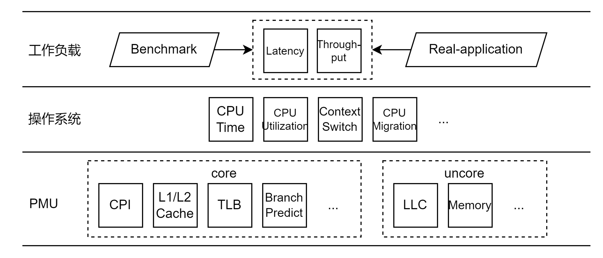

# hperf

## 概述

跨平台的微架构性能数据采集工具hperf

> 本文档标注\[开发中]的功能，将在未来版本中得到支持。

### 命名

hperf的名称取自Hierarchical Performance Profiling Tools，使用一种层次化的性能数据采集方法以及性能分析方法，Hierarchical具体体现在：

- 收集软硬件全栈各个层次的性能数据，从微架构层面的PMU性能数据到系统软件层面的操作系统性能数据，提供全面的工作负载性能画像
- 使用层次化的性能分析方法，逐层分解并定位到性能瓶颈

### 性能数据来源

hperf的性能数据来源包括底层PMU（核内部分与核外部分），操作系统，上层工作负载（包括benchmark与real-workload），各部分具有代表性的性能数据如下图所示：



> 目前工具还是主要关注PMU层面的微架构性能数据，OS层面的性能数据目前主要依靠perf的软件性能事件获得一些OS内核部分的统计数据。

### 特性

hperf的特性列举如下：

- 跨平台：支持主流平台，x86架构的Intel与AMD，ARM架构的Kunpeng与Ampere，并且可扩展，甚至拓展至RISC-V平台
- 准确、可靠的微架构性能数据采集：基于对主流底层PMU架构与Linux perf_event子系统调度机制的深入理解上，通过时分复用底层硬件计数器的方式，有效地采集充足的性能事件，设置性能事件组使得关联性能事件在同一时刻测量，保证导出指标的可靠性与准确性
- 跨平台的性能分析方法：通过采集得到的可靠的微架构性能数据，基于Iron Law对CPI进行逐层分解，给出微架构各个组件对性能的影响，以定位性能瓶颈
- 可视化图表支持（开发中）：hperf将会收集时间粒度更加细腻的性能数据信息，自动聚合性能数据，并基于时间关系展现可视化图表，帮助用户更加准确认知Workload的性能特征。

## 设计
### hperf命令行语法 
```bash
python hperf.py <command> [options]
```
#### python hperf.py
调用python运行hperf.py脚本文件。hperf.py是hperf的启动脚本。

#### \<command>
需要进行性能监测的Workload启动命令，例如：
```bash
sleep 5 
./602_gcc 
ls | grep hellworld
```
hperf命令行语法规定，\<command>是必选项，使用hperf必须指定action。

#### \[options]
|  选项     | 描述 |
| :-----------: | :-----------: |
| -h \|--help      |  显示hperf帮助信息      |
| -r \|--remote \[开发中]   | 指定hperf监测远程机器性能数据，在该选项后应指定SSH连接串 |
|-f \|--config-file\[开发中]|指定Json文件路径，其中包含hperf设置选项|
|-t \| --time|指定性能监测的时间（秒）|
|-v \| --verbose| 过滤冗余的log信息|
|-c \| --cpu|指定hperf监测的的CPU核心，默认为所有CPU核|
|--tmp-dir|指定存放原始性能数据的目录，默认为/tmp/hperf/|

> 若不加入-r \| --remote选项，hperf将会在本地机器执行性能监测任务。
> 若指定--tmp-dir，hperf将会对该目录进行权限检查。未通过检查则会自动将该目录改为/tmp/hperf/。
### 性能指标测量
根据Iron Law模型，对CPI逐层分解需要CPI，L1Cache Missrate， L2Cache Missrate，L3Cache Missrate，Branch Predictor Missrate。hperf将会输出这些性能指标与聚合后的性能事件数据。
### 推荐使用案例
```bash
python hperf.py -c 5 -v --tmp-dir ~/hperf/logs/ taskset -c 5 ./a.out 
```

在如上所示bash代码中，我们启动hperf获取a.out程序运行的性能数据。使用将该进程（a.out）绑定在CPU5上运行，忽略冗余的log信息，并且设置hperf存放原始数据文件的目录。
> 我们推荐使用hperf时，尽量使用-c选项指定CPU核，这样hperf测量的性能数据更具代表性。同时在\<command>中使用taskset指定Workload运行的CPU核心。

### 实际使用案例
待填。